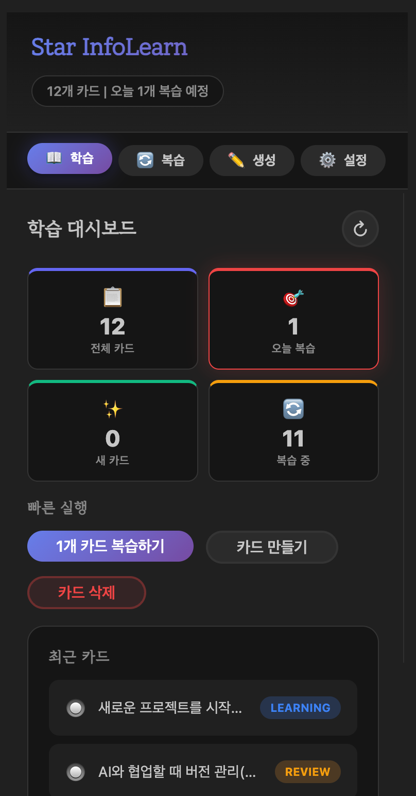
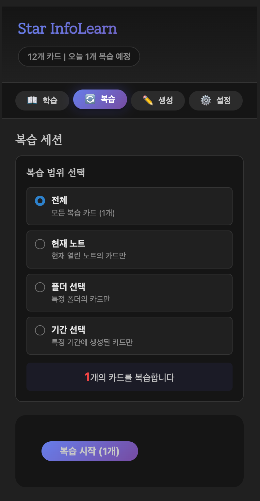
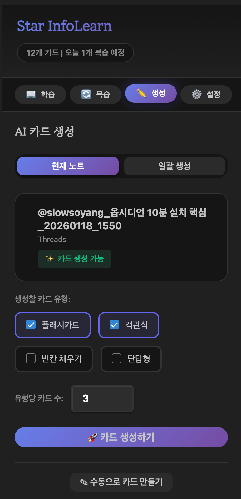

# Star InfoLearn

Obsidian을 위한 AI 기반 플래시카드 학습 플러그인


<p align="center">
  
  
  
</p>

## 주요 기능

- **AI 자동 카드 생성** - 노트 내용을 기반으로 플래시카드 자동 생성
- **4가지 퀴즈 유형** - 플래시카드, 객관식, 빈칸 채우기, 단답형
- **FSRS 간격 반복** - 과학적인 복습 스케줄링 알고리즘
- **복습 필터** - 노트별, 폴더별, 기간별 복습 범위 선택
- **학습 대시보드** - 통계 및 진행 상황 확인

## 지원 AI 제공자

| 제공자 | 모델 예시 |
|--------|----------|
| OpenAI | GPT-4, GPT-3.5 |
| Anthropic | Claude 3 |
| Google Gemini | Gemini Pro |
| Grok | Grok-1 |
| Zhipu | GLM-4 |

## 설치 방법

### BRAT을 사용한 설치 (권장)

[BRAT (Beta Reviewers Auto-update Tester)](https://github.com/TfTHacker/obsidian42-brat)을 사용하면 GitHub에서 직접 플러그인을 설치하고 자동 업데이트를 받을 수 있습니다.

#### 1. BRAT 플러그인 설치

1. Obsidian 설정 열기
2. **커뮤니티 플러그인** → **찾아보기** 클릭
3. "BRAT" 검색 후 설치
4. BRAT 플러그인 활성화

#### 2. Star InfoLearn 추가

1. 명령어 팔레트 열기 (`Ctrl/Cmd + P`)
2. **"BRAT: Add a beta plugin for testing"** 입력 및 선택
3. 저장소 URL 입력:
   ```
   starhunt/star-infolearn
   ```
4. **Add Plugin** 클릭

#### 3. 플러그인 활성화

1. 설정 → 커뮤니티 플러그인
2. **Star InfoLearn** 활성화
3. 사이드바에서 Star InfoLearn 아이콘 클릭

### 수동 설치

1. [최신 릴리즈](https://github.com/starhunt/star-infolearn/releases/latest)에서 다운로드:
   - `main.js`
   - `styles.css`
   - `manifest.json`

2. Obsidian vault의 `.obsidian/plugins/star-infolearn/` 폴더 생성 후 파일 복사

3. Obsidian 재시작 또는 새로고침 (`Ctrl/Cmd + R`)

4. 설정 → 커뮤니티 플러그인 → Star InfoLearn 활성화

## 사용법

### 1. AI 설정

1. Star InfoLearn 패널 열기 (사이드바 아이콘)
2. **설정** 탭 선택
3. AI 제공자 선택 및 API 키 입력
4. **연결 테스트**로 확인

### 2. 카드 생성

#### AI 자동 생성 (현재 노트)

1. 학습할 노트 열기
2. **생성** 탭 → **현재 노트** 모드 선택
3. 생성할 카드 유형 선택 (플래시카드, 객관식 등)
4. 유형당 카드 수 설정
5. **카드 생성하기** 클릭

#### 일괄 생성

1. **생성** 탭 → **일괄 생성** 모드 선택
2. 폴더 선택 및 옵션 설정
3. **일괄 생성 시작** 클릭

#### 수동 생성

1. **수동으로 카드 만들기** 클릭
2. 카드 유형, 질문, 정답 입력
3. **카드 생성** 클릭

### 3. 복습

1. **복습** 탭 선택
2. 복습 범위 선택:
   - **전체** - 모든 복습 카드
   - **현재 노트** - 현재 열린 노트의 카드만
   - **폴더 선택** - 특정 폴더의 카드만
   - **기간 선택** - 특정 기간에 생성된 카드만
3. **복습 시작** 클릭
4. 카드별로 평가 (Again / Hard / Good / Easy)

### 4. 대시보드

**학습** 탭에서 확인:

- 전체 카드 수
- 오늘 복습 예정
- 새 카드 / 복습 중 카드
- 최근 생성된 카드 목록
- 빠른 실행 버튼

## 데이터 저장 위치

모든 학습 데이터는 로컬에 저장됩니다:

```
.obsidian/plugins/star-infolearn/data/
├── cards/     # 학습 카드 (JSON)
├── decks/     # 덱/컬렉션
├── logs/      # 복습 로그
└── stats/     # 일일 통계
```

## 문제 해결

### 플러그인이 로드되지 않을 때

1. Obsidian 버전 확인 (0.15.0 이상 필요)
2. 플러그인 활성화 상태 확인
3. Obsidian 새로고침 (`Ctrl/Cmd + R`)

### AI 연결 실패

1. API 키 확인
2. 인터넷 연결 확인
3. API 크레딧 잔액 확인
4. 설정에서 연결 테스트 실행

## 라이선스

MIT License

## 문의 및 기여

- 이슈: [GitHub Issues](https://github.com/starhunt/star-infolearn/issues)
- PR 환영합니다!

---

**Star InfoLearn** - 노트를 플래시카드로, 학습을 더 효과적으로!
